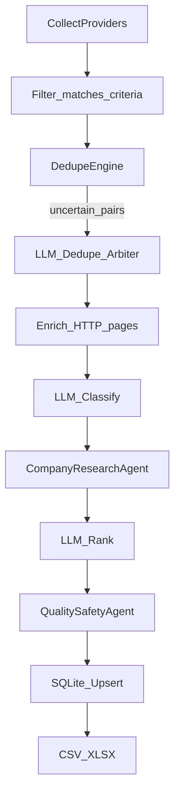

# Agentic accuracy upgrade (OpenAI)

## Goals

- Improve **accuracy** of matching and labeling (remote type, employment type, seniority) beyond heuristics.
- Add **intelligent ranking** so outputs prioritize the best matches.
- Add **agentic enrichment** (job summary, requirements, tech stack) and **company context** using already-fetched pages.
- Add **safety/quality alerting** (scam signals, suspicious domains, missing apply flow).
- Keep AI features **optional** and **safe-by-default** (no auto-apply, no external browsing beyond pages we already fetch for the job).

## Key design decisions

- **Provider interface**: Introduce `jobscout/llm/provider.py` with a minimal `LLMClient` abstraction.
- **OpenAI implementation**: Add `jobscout/llm/openai_client.py` using env vars:
  - `JOBSCOUT_OPENAI_API_KEY`
  - `JOBSCOUT_OPENAI_MODEL` (default e.g. `gpt-4o-mini`)
  - `JOBSCOUT_OPENAI_BASE_URL` (optional)
- **Cost controls**:
  - Only run LLM steps on the **post-filtered, post-deduped** set (except selective dedupe arbitration).
  - Add per-run caps: `max_llm_jobs`, `max_llm_dedupe_checks`.
  - Cache LLM responses in SQLite keyed by `(job_id, step, prompt_hash)`.

## Data model changes

- Extend `NormalizedJob` with optional AI fields:
  - `ai_score` (float)
  - `ai_reasons` (short text)
  - `ai_remote_type`, `ai_employment_types`, `ai_seniority`, `ai_confidence`
  - `ai_summary`, `ai_requirements`, `ai_tech_stack`
  - `ai_company_domain`, `ai_company_summary`
  - `ai_flags` (JSON list of strings)
- Update [`storage/sqlite.py`](storage/sqlite.py) schema to store these (new nullable columns + a `llm_cache` table).
- Update exports to include key AI columns.

## Agentic pipeline integration

- Update [`orchestrator.py`](orchestrator.py) to optionally run these steps:

### 1) LLM classification (accuracy)

- New module `jobscout/llm/classify.py`:
  - Inputs: title, location_raw, description_text (truncated), tags.
  - Outputs: normalized fields + confidence.
  - Update `NormalizedJob.remote_type` and `employment_types` **only when confidence is high**, otherwise store into `ai_*` fields.

### 2) LLM ranking (intelligence)

- New module `jobscout/llm/rank.py`:
  - Inputs: `Criteria` + list of jobs.
  - Output: `ai_score` + `ai_reasons` per job.
  - Score uses rubric: match to must/any keywords, remote/geo compatibility, seniority alignment, “automation stack” relevance.

### 3) Selective LLM dedupe arbitration

- Enhance [`dedupe.py`](dedupe.py) to expose “uncertain candidate pairs” when fuzzy similarity is near-threshold.
- New module `jobscout/llm/dedupe_arbiter.py`:
  - Ask LLM: “same job?” and “preferred canonical fields?”
  - Only invoked for a small capped set.

### 4) LLM enrichment summaries

- New module `jobscout/llm/enrich_job.py`:
  - Produces a concise summary, key requirements, tech stack list, and salary normalization notes.

### 5) Company research agent (no extra browsing)

- New module `jobscout/llm/company_agent.py`:
  - Uses **already fetched** HTML/text from enrichment step.
  - Extract/confirm likely company domain, short company summary, and sanity-check socials.

### 6) Quality/safety alerting agent

- New module `jobscout/llm/alerts.py`:
  - Flags: suspicious domain mismatch, missing apply URL, “pay-to-apply”, crypto scams, unrealistic salary claims, etc.
  - Store into `ai_flags`.

## CLI updates

- Update [`cli.py`](cli.py) to add:
  - `--ai` (enable AI features)
  - `--ai-model`, `--ai-max-jobs`, `--ai-max-dedupe`, `--ai-cache/--no-ai-cache`
  - `--ai-only-rank` / `--ai-only-classify` (optional convenience)

## Docs

- Update [`README.md`](README.md):
  - How to set `JOBSCOUT_OPENAI_API_KEY`
  - Cost control knobs
  - Privacy note: job content is sent to OpenAI only when AI is enabled.

## Acceptance checks

- `python -m jobscout "automation engineer" --ai -v` runs end-to-end and produces DB+CSV+XLSX with AI columns populated.
- Running without `--ai` behaves exactly as today.