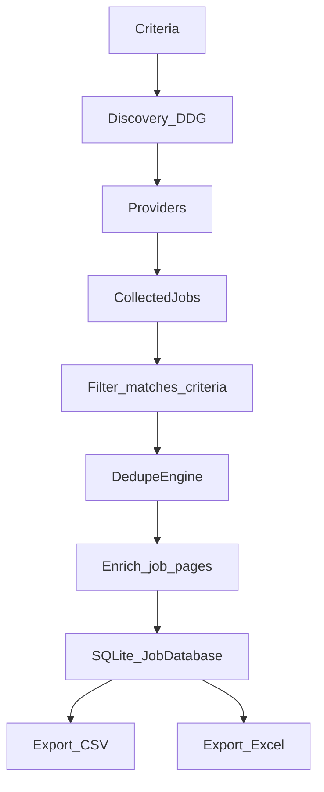

# JobScout runner + CLI

## What’s missing right now

- The package exports `run_scrape` from `jobscout.orchestrator`, but [`orchestrator.py`](__init__.py) doesn’t exist yet. This is the main blocker for an end-to-end run.

## Implementation plan

- **Add the orchestration layer** in [`orchestrator.py`](orchestrator.py):
  - Implement `async def run_scrape(criteria: Criteria, ...) -> RunStats` that:
    - Creates an `HttpFetcher` (and optional `BrowserFetcher` if `criteria.use_browser`).
    - Runs discovery via `providers.discovery.discover_all(criteria)` (gracefully no-op if `duckduckgo_search` isn’t installed).
    - Instantiates providers:
      - Always-on APIs/feeds: `RemotiveProvider`, `RemoteOKProvider`, `ArbeitnowProvider`, `WWRRssProvider`.
      - Discovered ATS providers when tokens exist: `GreenhouseProvider`, `LeverProvider`, `AshbyProvider`, `RecruiteeProvider`.
      - Discovered “other URLs” via `SchemaOrgProvider` (optionally using browser fetcher).
    - Collects provider results concurrently (bounded by `criteria.concurrency`).
    - Applies `NormalizedJob.matches_criteria(criteria)` filtering.
    - Deduplicates within-run using `DedupeEngine` from [`dedupe.py`](dedupe.py).
    - Optionally enriches jobs using `extract.enrich.enrich_job` (bounded concurrency, `criteria.max_enrichment_pages`).
    - Persists results and run stats in SQLite via [`storage/sqlite.py`](storage/sqlite.py).
    - Exports to **CSV + Excel** by default (per your choice), using `JobDatabase.export_to_csv` and `JobDatabase.export_to_excel`.

- **Add a CLI** in [`cli.py`](cli.py):
  - `python -m jobscout ...` interface with `argparse`:
    - Inputs: `primary_query`, `location`, `must_include`, `any_include`, `must_exclude`, plus key flags (remote-only, strict-remote, browser, cache, concurrency, max results).
    - Outputs: `--db`, `--csv`, `--xlsx`, `--days` (for export window).
  - Call `asyncio.run(run_scrape(...))` and print a short summary (counts, errors, output paths).

- **Enable module execution** with [`__main__.py`](__main__.py):
  - Delegate to `cli.main()` so `python -m jobscout` works.

- **Add dependencies + basic docs**:
  - Add [`requirements.txt`](requirements.txt) with required runtime libs used in the codebase (`aiohttp`, `beautifulsoup4`, `lxml`, `pandas`, `openpyxl`).
  - Add [`README.md`](README.md) describing install/run, and optional extras:
    - Discovery: `duckduckgo_search` (optional).
    - Browser mode: `playwright` + `playwright install chromium` (optional).

## Dataflow (end-to-end)

