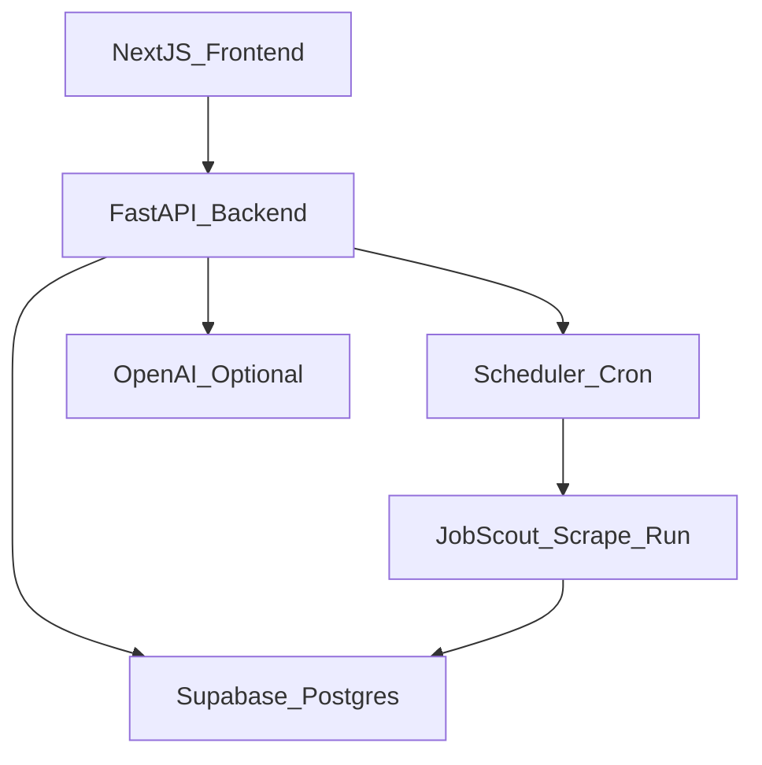

# Product Hunt launch: full web product

## Target outcome (v1)

- **Public, no-login web app**: fast job feed, search + filters, shareable URLs, job detail pages, and “Top matches” ranking.
- **Backend service**: scheduled scraping runs + public read API.
- **Low cost**: minimize always-on compute, cap AI calls, cache AI outputs.

## Architecture

- **Frontend**: Next.js (App Router) deployed on Vercel.
- **Backend**: FastAPI service that runs scrapes on a schedule and exposes read endpoints.
- **DB**: Supabase Postgres (free tier) to store jobs + run logs.
- **AI**: Optional and cost-capped.
  - Default model recommendation for cost/quality: **`gpt-4o-mini`**.
  - Use AI only for: classification + scoring/ranking on the top N candidates; store results; reuse via caching.
  - Add optional embeddings for semantic search with a cheap embedding model later; keep v1 simple.

## Backend plan (FastAPI)

- Create `backend/` package:
  - **API**
    - `GET /jobs` with query params (q, location, remote, employment, tags, posted_since)
    - `GET /jobs/{job_id}`
    - `GET /stats` (counts, last run)
    - `POST /admin/run` (trigger a scrape) protected by `JOBSCOUT_ADMIN_TOKEN`
  - **Ingestion worker**
    - Runs existing `run_scrape` using a set of configured “collections” (e.g. Automation, Data, AI Ops)
    - Writes to Postgres (new storage adapter)
  - **Scheduler**
    - APScheduler or cron-like loop (simple, resilient) to run scraping periodically
- Add a Postgres storage adapter alongside SQLite:
  - `storage/postgres.py` with upserts + indexes optimized for search.
  - Keep SQLite for local dev.

## Frontend plan (Next.js UI/UX)

- Create `frontend/` (Next.js + Tailwind) with a Notion/Apple-inspired minimal UI:
  - **Home/search**: single focused search field, smart filters panel, fast results.
  - **Results**: clean cards with strong hierarchy (title, company, remote badge, location, posted date, AI score).
  - **Job detail**: side panel/drawer + dedicated `/job/[id]` route.
  - **Shareable links**: filter state encoded in URL.
  - **Performance**: server-side rendering for SEO + skeleton loading.
  - **Trust signals**: “last updated”, source badges, and safety flags.

## Deploy plan (low cost)

- **Vercel (free)**: host Next.js frontend.
- **Supabase (free)**: Postgres + optional API keys/Row Level Security (read-only public for v1).
- **Backend host**: small always-on container with minimal RAM.
  - Provide Dockerfile + deploy guides for **Fly.io** or **Render** (whichever is free).

## Integrations

- **OpenAI** (optional): enable AI ranking/classification under strict caps.
- **Supabase**: DB and (optional later) auth.
- **Analytics** (optional): lightweight (Plausible/PostHog) for PH launch metrics.

## Launch polish

- Add landing page sections: value prop, how it works, privacy, and “submit feedback”.
- Add `robots.txt`, `sitemap.xml`, OpenGraph images.