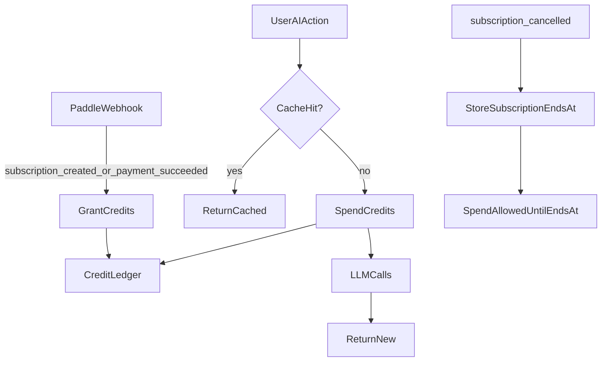

# Pricing + Credits Model (Rev 2)

## What changed vs Rev 1

- **Free plan** now includes:
  - **Tracking** (already supported today; keep the cap, but ensure it’s explicitly “on” in messaging)
  - **DOCX export** so the 2 free Apply Packs produce a real downloadable deliverable
- **Credits expiry** changes from “~45 days” to **“valid while subscription is valid”** (credits become unusable when the subscription ends)

## Pricing model (USD) — sprint-first, competitive, profitable

- **Free ($0)**
  - **2 Apply Packs/month**
  - **Track active applications: ON**
  - **DOCX export: ON (free but limited)**
    - Recommended: allow **6 DOCX exports/month** (covers 2 packs × resume/cover/combined)
    - Rationale: users can download tangible outputs without paying; you keep abuse bounded.
- **Sprint Weekly ($7/week, recurring weekly)**
  - 30 Apply Packs/week
  - Unlimited tracker + DOCX export
- **Pro Monthly ($29/month)**
  - 150 Apply Packs/month
  - Unlimited tracker + DOCX export
- **Power Monthly ($49/month)**
  - 300 Apply Packs/month
  - Everything in Pro + higher Premium AI limits
- **Annual Pro ($299/year)**
  - 150 Apply Packs/month
  - Same features as Pro Monthly
- **Annual Power ($499/year)**
  - 300 Apply Packs/month
  - Same features as Power Monthly
- **Add-ons (usage-based top-ups)**
  - Keep credit top-ups priced worse than subscriptions so they don’t replace upgrading.

## Credits system — revised expiry policy

### Why “expire with subscription” is a strong alternative (your preference)

- **Much more user-friendly:** people in sprints don’t feel punished for not using credits immediately.
- **Aligns with the mental model:** “As long as I’m paying, my credits are mine.”
- **Better retention lever:** users stay subscribed to keep their bank.

### The revised rule

- **Subscription credits do not expire while the subscription remains valid.**
- If the subscription is **cancelled**, credits remain usable until the **cancellation effective date** (`subscription_ends_at`).
- After the subscription ends, remaining **subscription credits are not spendable** (effectively expired).

## Implementation implications in this repo (high-level)

- **Free tracking is already enabled today**
  - Current quota logic: `tracking=5` for free in `[backend/app/storage/apply_storage.py](backend/app/storage/apply_storage.py)`.
- **Free DOCX export requires a real quota change**
  - Today free has `docx_export=0` (blocked) in `[backend/app/storage/apply_storage.py](backend/app/storage/apply_storage.py)`.
  - The export endpoint enforces this via `check_user_quota(..., "docx_export")` in `[backend/app/api/apply.py](backend/app/api/apply.py)`.
- **“Expire with subscription” requires fixing current cancelled handling**
  - Today, quota logic treats `subscription_status='cancelled'` as effectively free immediately.
  - To match “valid until period end,” update the paid-check logic in:
    - `[backend/app/storage/apply_storage.py](backend/app/storage/apply_storage.py)` (`check_user_quota`)
    - `[backend/app/services/apply_pack_review.py](backend/app/services/apply_pack_review.py)` (`_is_paid_user`)
  - New rule: if status is `cancelled` and `subscription_ends_at > now`, treat as paid.
- **Credit ledger remains the same design**
  - Keep the proposed `credit_ledger` table.
  - Change grant expiry behavior:
    - Either set `expires_at = NULL` for subscription grants and gate spend by subscription validity, or
    - Set `expires_at = subscription_ends_at` once cancellation is known.

