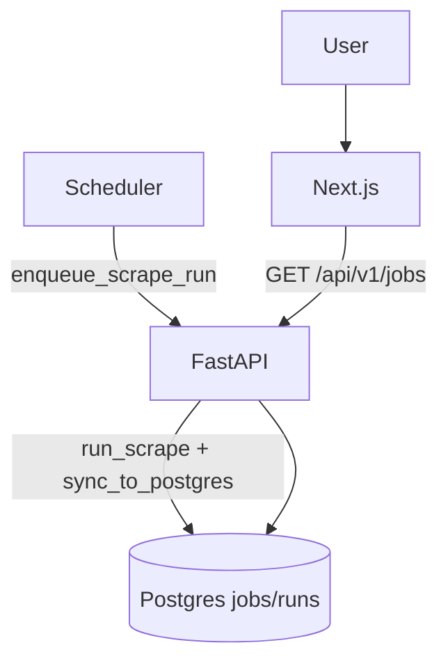

# JobScout stabilization plan

## Goals

- **Remove user-visible noise** (favicon 404, DuckDuckGo rename warnings).
- **Stop end-users from triggering scrapes** (scheduled + admin-only ingestion).
- **Improve provider reliability + debuggability** (so “1 errors” tells you why, and we can decide which sources to keep).
- **Fix misleading backend logs** ("Total jobs in DB: N/A").

## What I’ll change

### 1) Remove favicon 404

- **Add a real favicon asset** so browsers stop requesting a missing `/favicon.ico`.
  - Add either `frontend/public/favicon.ico` (simplest) or `frontend/app/favicon.ico`.
- **Declare icons in Next metadata** (optional but recommended) in [`frontend/app/layout.tsx`](frontend/app/layout.tsx) via `metadata.icons`.
- **Fix `frontend/app/icon.svg`** (it currently appears empty), or remove it if unused.

### 2) Make scraping scheduled/admin-only (no public scraping)

- **Backend**
  - Set `JOBSCOUT_PUBLIC_SCRAPE_ENABLED=false` in Fly secrets (keeps endpoint returning 404).
  - Keep `POST /api/v1/admin/run` for manual/admin triggering.
  - Extend the scheduler to run **a list of queries** (not just one) by adding a new env var:
    - `JOBSCOUT_SCHEDULED_QUERIES` (JSON array string or comma-separated list)
    - Fallback to existing `JOBSCOUT_DEFAULT_SEARCH_QUERY` if not provided.
  - Files:
    - [`backend/app/core/config.py`](backend/app/core/config.py) (new setting)
    - [`backend/app/main.py`](backend/app/main.py) or [`backend/app/worker.py`](backend/app/worker.py) (scheduler loop)
    - [`backend/env.sample`](backend/env.sample) + [`AGENTS.md`](AGENTS.md) (document)

- **Frontend**
  - Remove/hide all user-triggered scrape UI (AI icon + auto-trigger).
  - Keep the search bar and the filters as it is to search only within the available jobs listed.
  - Keep search as **pure DB query** (`GET /jobs`).
  - Files:
    - [`frontend/components/SearchBar.tsx`](frontend/components/SearchBar.tsx)
    - [`frontend/lib/api.ts`](frontend/lib/api.ts) (optionally keep `triggerScrape` only for admin UI later)

#### New flow (high level)

### 3) Remove DuckDuckGo runtime warnings

Your warning happens because `duckduckgo_search` renamed to `ddgs`.

- Update discovery dependency + imports:
  - Prefer `ddgs` import first, fall back to `duckduckgo_search`.
  - Update [`pyproject.toml`](pyproject.toml) optional dependency group from `duckduckgo_search` to `ddgs`.
  - Update [`jobscout/providers/discovery.py`](jobscout/providers/discovery.py) to use the new package API.
- Optional: add a targeted `warnings.filterwarnings(...)` only if needed.

### 4) Why only 4 sources succeed / fix provider failures

Right now, failures are opaque because orchestrator swallows exceptions:

- In [`jobscout/orchestrator.py`](jobscout/orchestrator.py), `_collect_from_provider()` returns `(name, [], 1)` on exception and **doesn’t log the exception or provider error_messages**.

Fixes:

- **Improve logging/observability**
  - Log exception + a short reason per provider.
  - Surface `provider.stats.error_messages` when available.
- **Introduce provider allowlist** (so production runs only use stable sources)
  - Add env var `JOBSCOUT_ENABLED_PROVIDERS` (comma-separated), defaulting to the 4 stable sources you’re seeing succeed.
  - Gate provider instantiation in orchestrator.

Then, source-by-source triage (likely causes):

- **Indeed/FlexJobs**: often blocked/anti-bot and may require browser automation; may violate ToS depending on approach.
- **StackOverflow Jobs**: discontinued; likely broken.
- **Wellfound**: frequently changes HTML/API; may require auth/cookies.
- **WorkingNomads/RemoteCo**: HTML structure changes / rate limits.
- Find and add new providers for more broad scraping and hence more jobs to list.

We’ll start by making errors visible, then decide which providers are worth fixing vs disabling.

### 5) Fix “Total jobs in DB: N/A”

In [`jobscout/orchestrator.py`](jobscout/orchestrator.py), it calls `db.close()` and then logs `db.get_job_count() if db._conn else 'N/A'`, so it prints **N/A** after closing.

- Move the log **before** `db.close()`, or store `count = db.get_job_count()` before closing.

### 6) AI: keep admin-only (as you chose)

- Keep AI code, but make it **admin/scheduled-only**:
  - Backend: ignore `use_ai` on any public path.
  - Frontend: remove AI toggle.
  - Admin endpoint can still accept `use_ai`.
- Add safety guardrails:
  - Hard cap `JOBSCOUT_AI_MAX_JOBS` and ensure it’s enforced.

## Rollout steps

- Deploy backend changes to Fly.
- Update Fly secrets (`JOBSCOUT_PUBLIC_SCRAPE_ENABLED=false`, plus new scheduled/provider vars).
- Deploy frontend to Vercel (remove scrape UI + add favicon).
- Verify in production:
  - No `/favicon.ico` 404
  - No DuckDuckGo rename warnings
  - No public scrape calls from frontend
  - Scheduler populates Postgres and users can browse/search without scraping
  - Provider failures show actionable error messages