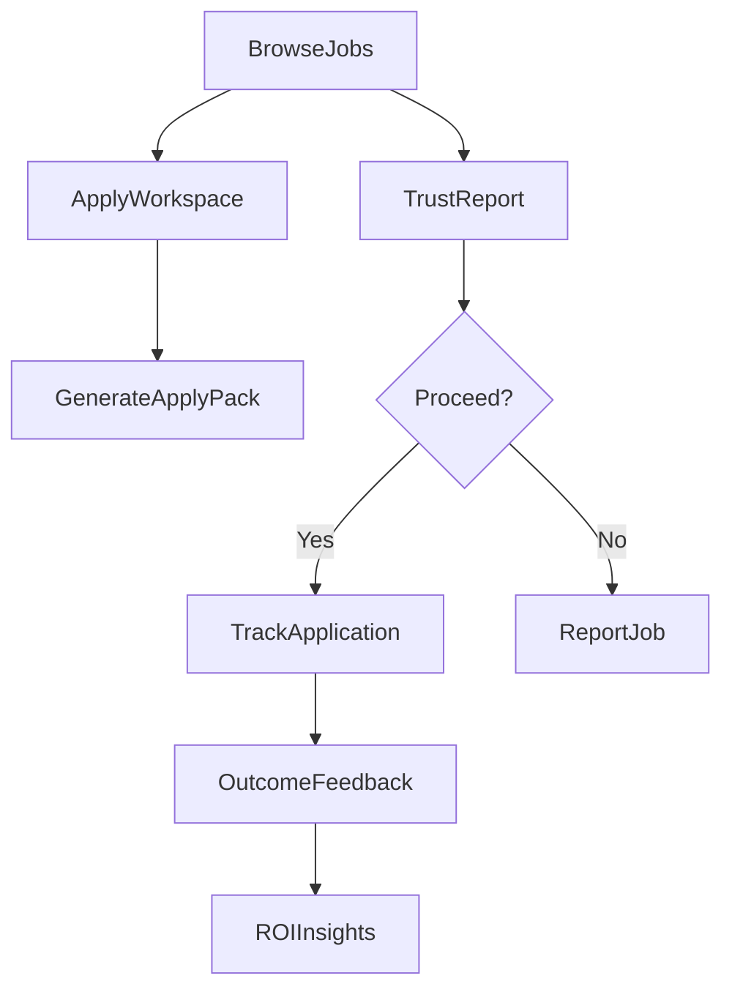

# JobScoutAI upgrade plan (robust + cost-controlled)

**Implementation complete (all phases).** Verification: frontend lint + build, backend compile pass. See AGENTS.md for provider list, Premium AI env, and extension README.

## Product goal and positioning

- **Goal**: Make JobScoutAI the fastest way to go from “job found” → “trustworthy?” → “application sent” → “tracked outcomes,” with clear ROI.
- **Differentiator to amplify** (from the audit): **Trust Report** + integrated workflow. Competitors and ChatGPT don’t reliably prevent scams/ghost jobs or manage the end-to-end pipeline.
- **Cost guardrails** (hard rules):
  - Default to **heuristics + caching**; AI is **optional**, **rate-limited**, and **quota-gated**.
  - Prefer **free/low-cost data** (domain consistency, link health, on-page signals, public registries) over paid APIs.
  - Avoid “always-on” enrichment (no per-job external API fanout; no mandatory browser rendering).

## Current foundation (what you already have)

- **Apply Workspace + tracking APIs exist** in `[backend/app/api/apply.py](backend/app/api/apply.py)` (job parse/import, trust report, apply pack, applications, feedback, quotas).
- **Trust signals are heuristic and explainable** in `[backend/app/services/trust_analyzer.py](backend/app/services/trust_analyzer.py)` (scam/ghost/staleness, apply-link test, domain consistency, overall trust score).
- **Scrape run tracking (Postgres) exists** in `[backend/app/api/runs.py](backend/app/api/runs.py)` and worker pipeline in `[backend/app/worker.py](backend/app/worker.py)`.
- **Frontend entry points exist**: job board `[frontend/app/page.tsx](frontend/app/page.tsx)` and Apply Workspace `[frontend/app/apply/page.tsx](frontend/app/apply/page.tsx)` + history/tracking `[frontend/app/apply/history/page.tsx](frontend/app/apply/history/page.tsx)`.

## Target user flows (what we’ll optimize)

## Phase 0 (1–2 weeks): Make the experience reliable + measurable

- **Ship product analytics that don’t increase infra cost** (client events + minimal backend aggregation).
  - Instrument activation and conversion events already referenced by frontend analytics calls (e.g., `trackApplyPackCreated`, `trackTrustReportGenerated`).
  - Add a simple **server-side daily rollup job** (optional) or compute in Postgres views.
- **Polish the onboarding funnel**:
  - Ensure Apply Workspace reliably guides: resume → job → trust → pack → track.
  - Add UI copy that explicitly sells the differentiator: “don’t waste time on ghost/scam jobs.”
- **Definition of done**:
  - Activation metric: % of users who generate first pack within 10 minutes of landing.
  - Trust metric: % of parsed jobs with Trust Report viewed.
  - Tracker metric: % of packs that become a tracked application.

## Phase 1 (2–4 weeks): Trust Report v2 (higher perceived value, still low cost)

Focus: **transparency + credibility** without paid data sources.

- **Explainability upgrades**:
  - Add “Why we flagged this” panels with **source-aware** reasons (you already have reasons lists).
  - Add a **confidence indicator** per sub-score (simple heuristic: number/strength of signals).
- **Community feedback loop (cheap, high leverage)**:
  - Add **“Report job”** + **“This was accurate / inaccurate”** feedback.
  - Persist to a Postgres table; use it to:
    - down-rank repeatedly flagged postings,
    - improve heuristics (source-specific token allowlists like `KNOWN_LEGITIMATE_TOKENS`).
- **Low-cost enrichment (no paid APIs)**:
  - Expand domain checks: mismatch severity, shortened URLs, redirect chains (cap at 1–2 requests).
  - Improve apply-link checks (already present via `_test_apply_link` with short timeout): add caching TTL + manual refresh.
  - Add “staleness policy” that sets expectations (“last verified X days ago”).
- **Definition of done**:
  - Trust Report shown in <2s for cached results, <6–8s worst-case on first run.
  - At least 80% of Trust Reports include actionable “next step” (apply, verify company, avoid).

## Phase 2 (3–6 weeks): Application Tracker that competes with Teal/JobScan (without costly integrations)

Focus: make tracking feel “premium” with mostly UI + DB work.

- **Kanban tracker UI** (Saved → Applied → Interview → Offer → Rejected) built on existing endpoints in `[backend/app/api/apply.py](backend/app/api/apply.py)` and history page.
- **Reminders and calendar export** (low-cost):
  - Add reminder scheduling in UI (already supported by `reminder_at`).
  - Add **ICS export** for reminders/interviews (no Google API required).
- **Contact + notes**:
  - Store recruiter/contact fields on `applications` (email/linkedin/phone), shown in tracker.
- **Outcome feedback loop**:
  - Improve feedback capture UI (already exists in history page) and add “recommendation” cards: e.g., “most common rejection reasons,” “skills gaps” based on user-tagged reasons.
- **Definition of done**:
  - Users can manage 50+ applications smoothly.
  - Time-to-update status <10 seconds.

## Phase 3 (3–6 weeks): Chrome/Edge extension v1 (big value, minimal runtime cost)

Focus: increase capture + retention; extension mostly runs client-side.

- **Core actions**:
  - “Save job” button on LinkedIn/Indeed/ATS pages.
  - Extract title/company/location/apply URL/description text from DOM.
  - Send to backend via an authenticated endpoint (reuse `/apply/job/import` pattern).
- **Cost controls**:
  - No server-side crawling; the extension ships the page content the user already loaded.
  - Rate-limit saves per user per hour.
- **Definition of done**:
  - 1-click save creates a job_target + Trust Report prompt.
  - ≥30% of saved jobs proceed to pack generation.

## Phase 4 (ongoing): Job sourcing depth without cost spikes

Focus: more sources, better dedupe, keep requests bounded.

- **Prefer structured sources** (RSS/JSON/ATS public endpoints) over heavy scraping.
- **Provider add strategy** (from codebase): add new `Provider` modules and register in `[jobscout/orchestrator.py](jobscout/orchestrator.py)`; ensure stable `provider_id` to reduce duplicates.
- **Discovery controls**:
  - Keep discovery bounded (`Criteria.max_search_results`, `Criteria.max_discovered_ats_tokens`).
  - Default `enrich_company_pages` off for public scrapes; allow paid users to enable with caps.
- **Definition of done**:
  - Add 3–5 high-quality sources with low bot-risk.
  - Maintain dedupe quality (≤5% obvious duplicates in top 100 results).

## Phase 5 (optional, gated): “AI where it matters” (cap spend; make it feel premium)

Only after phases 1–3 ship and conversion improves.

- **AI Interview Coach**: generate questions based on (resume + JD) and do rubric-based feedback.
- **Tone/templates** for cover letters and bullets (conservative/technical/enthusiastic).
- **Strict cost controls**:
  - Cache by `(resume_hash, job_hash, template_id)`.
  - Per-user monthly caps; higher caps on paid tiers.
  - Use smaller/faster models where acceptable; limit context length.

## Packaging and pricing (value without infra blowups)

- **Free**: limited packs + basic tracker count + basic trust.
- **Pro (€9)**: unlimited tracking, Trust Report v2, extension, reminders/ICS export.
- **Pro+ (€19)**: higher AI caps, advanced insights, priority processing.

## Risks and mitigations

- **Trust false positives**: mitigate with transparency + user feedback + source-aware tokens.
- **Extension breakage**: mitigate with per-site extractors + graceful fallback “copy/paste JD.”
- **Cost creep from AI/enrichment**: enforce quotas, caching, and strict defaults (heuristics first).

## Acceptance checklist

- Trust Report is explainable, fast, and actionable.
- Tracker feels like a real workflow tool (Kanban, reminders, feedback, insights).
- Extension reliably saves jobs from major sites with minimal server load.
- Metrics show improved activation and conversion without increased per-user variable cost.

